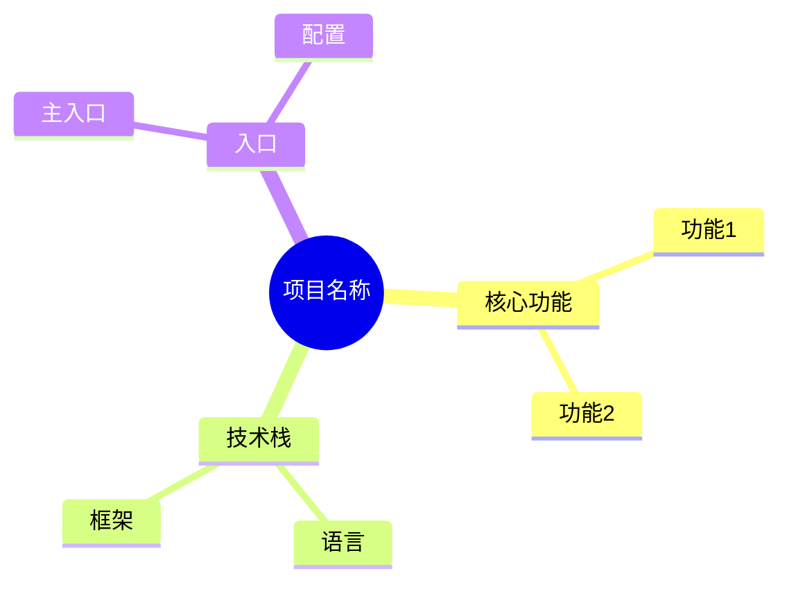

# 全局盘点

## 目标
快速建立对代码仓库的全局认识，回答"这个仓库是什么"。

## 分析要求

1. 用功能视角概括这个仓库在解决什么问题
2. 识别项目类型：CLI / Web / 服务端 / SDK / Agent / 工具库 / 桌面端 / 混合型
3. 列出你观察到的主要技术栈
4. 指出最关键的文档、配置、入口文件
5. 给出一个 5 行以内的项目一句话总结

## 输出格式

```markdown
## 项目定位
[描述项目解决的核心问题]

## 技术栈
- 语言：
- 框架：
- 关键依赖：

## 关键入口
- 主入口：
- 配置入口：
- 测试入口：

## 关键文档
- README：
- API 文档：
- 架构文档：

## 一句话总结
[5 行以内的精炼总结]
```

## Mermaid 图表示例



## 适用场景
- 分析整个项目时作为第一步
- 快速了解新项目
- 项目概述文档生成
