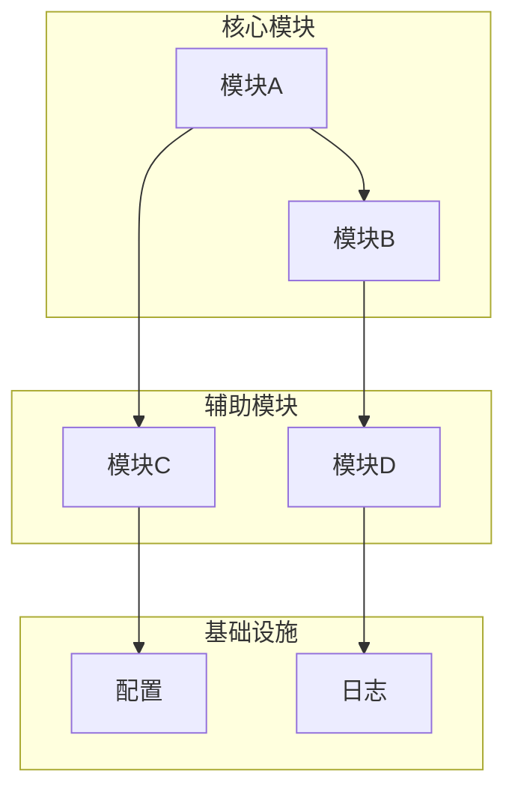

# 目录扫描

## 目标
按功能模块而非目录结构划分仓库，理解"系统由什么组成"。

## 分析要求

1. 将仓库拆成若干功能模块
2. 每个模块说明职责、边界、输入、输出
3. 标出核心模块、辅助模块、基础设施模块
4. 说明各模块之间的依赖关系
5. 如果目录结构与功能结构不一致，请指出差异

## 输出格式

```markdown
## 模块清单

### 核心模块
| 模块名 | 职责 | 边界 | 输入 | 输出 |
|--------|------|------|------|------|
| | | | | |

### 辅助模块
| 模块名 | 职责 | 边界 | 输入 | 输出 |
|--------|------|------|------|------|

### 基础设施模块
| 模块名 | 职责 | 边界 | 输入 | 输出 |
|--------|------|------|------|------|

## 依赖关系
[描述模块间如何协作]

## 目录与功能映射
| 目录路径 | 功能模块 | 是否一致 | 差异说明 |
|----------|----------|----------|----------|
| | | | |
```

## Mermaid 图表示例



## 适用场景
- 分析文件夹、模块、整个项目
- 理解系统组成结构
- 重构前梳理边界
