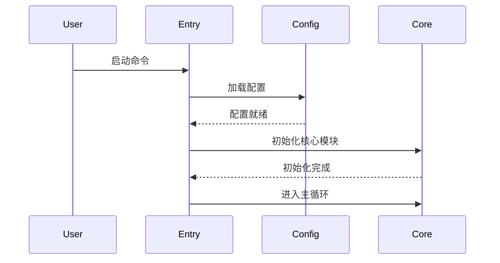
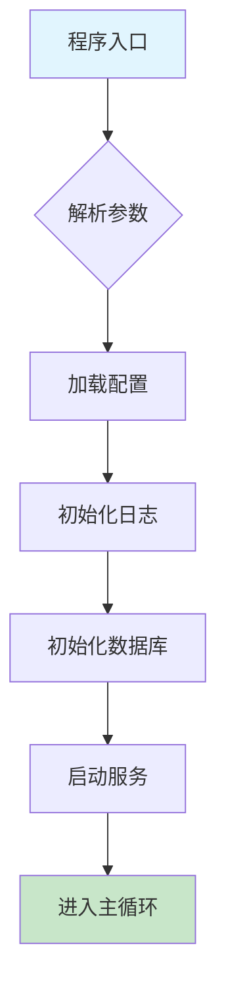

# 入口定位

## 目标
找到程序从哪里开始运行，追踪启动路径。

## 分析要求

1. 找出 main / CLI / API entry / daemon entry / test entry
2. 解释启动参数如何被解析
3. 追踪启动后第一批调用进入了哪些模块
4. 标记初始化阶段和运行阶段的边界
5. 给出"从启动到进入主逻辑"的完整链路

## 输出格式

```markdown
## 启动入口

### 主入口
- 文件位置：
- 入口函数：
- 触发方式：

### 其他入口
| 入口类型 | 文件位置 | 入口函数 | 触发方式 |
|----------|----------|----------|----------|
| CLI | | | |
| API | | | |
| Test | | | |

## 参数解析
[说明命令行参数、环境变量、配置文件如何被解析]

## 初始化流程
1. [第一步初始化]
2. [第二步初始化]
...

## 初始化与运行边界
- 初始化阶段完成标志：
- 运行阶段开始标志：

## 关键调用链
[从入口到主逻辑的调用路径]
```

## Mermaid 图表示例





## 适用场景
- 分析文件、模块、整个项目
- 理解程序启动流程
- 排查启动问题
