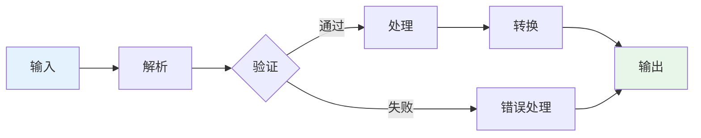
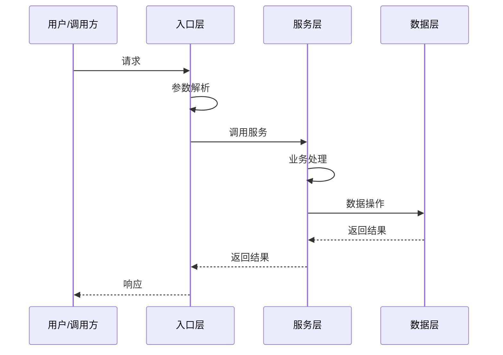

# 主链路分析

## 目标
追踪一个完整任务/请求/命令从输入到输出的主链路，理解"系统如何工作"。

## 分析要求

1. 从最外层入口开始追踪
2. 找出中间经过的核心函数、类、对象
3. 解释每一步输入输出如何变化
4. 说明何处做了状态更新、缓存、重试、回滚、异常处理
5. 最终画出一条端到端执行路径

## 输出格式

```markdown
## 链路概述
[简要描述这条主链路完成什么任务]

## 链路节点

### 节点1: [入口]
- 位置：
- 输入：
- 输出：
- 处理逻辑：

### 节点2: [处理]
- 位置：
- 输入：
- 输出：
- 处理逻辑：

## 关键处理点
| 类型 | 位置 | 说明 |
|------|------|------|
| 状态更新 | | |
| 缓存 | | |
| 重试 | | |
| 异常处理 | | |

## 完整链路
User/CLI/HTTP/Event → ... → Final Output
```

## Mermaid 图表示例





## 适用场景
- 分析函数、文件、模块
- 理解核心业务流程
- 排查流程问题
