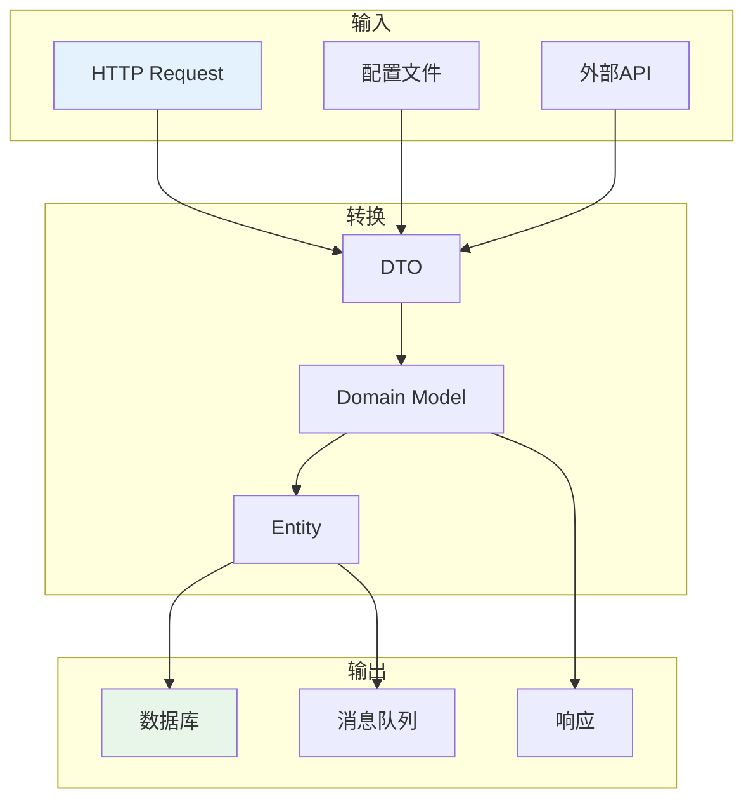
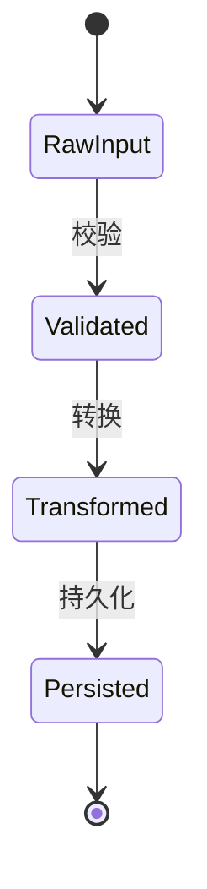

# 数据流分析

## 目标
分析数据如何在系统里流动，理解"数据从哪来、到哪去、怎么变"。

## 分析要求

1. 找出主要数据对象、DTO、模型、上下文结构
2. 说明数据从哪里进入，从哪里离开
3. 识别数据在模块间如何转换
4. 标出序列化/反序列化/校验/清洗/持久化位置
5. 如果存在 pipeline、stream、queue、event bus，也要说明

## 输出格式

```markdown
## 核心数据对象

### [数据对象1]
- 定义位置：
- 字段说明：
- 用途：

### [数据对象2]
- 定义位置：
- 字段说明：
- 用途：

## 数据流向

### 入口数据
- 来源：
- 格式：
- 进入点：

### 出口数据
- 目的地：
- 格式：
- 离开点：

## 数据转换点
| 转换位置 | 输入类型 | 输出类型 | 转换逻辑 |
|----------|----------|----------|----------|
| | | | |

## 数据处理点
| 处理类型 | 位置 | 说明 |
|----------|------|------|
| 序列化 | | |
| 反序列化 | | |
| 校验 | | |
| 清洗 | | |
| 持久化 | | |
```

## Mermaid 图表示例





## 适用场景
- 分析变量、函数、文件、模块
- 理解数据生命周期
- 数据问题排查
