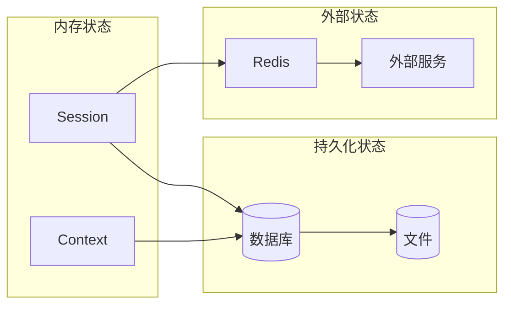
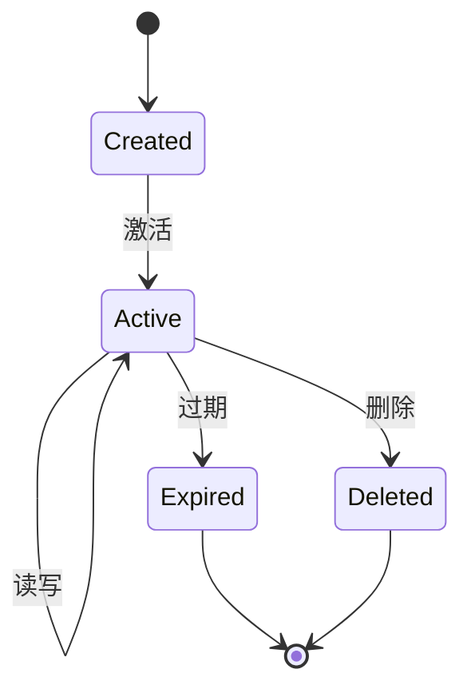

# 状态管理

## 目标
分析系统记住了什么，理解状态如何存储、更新和清理。

## 分析要求

1. 找出短期状态、长期状态、上下文状态、缓存状态
2. 说明状态存在哪里：内存、文件、数据库、KV、向量库、外部服务
3. 说明状态何时读、何时写、何时清理
4. 说明状态是否跨任务、跨会话、跨进程存在
5. 指出可能的状态一致性问题

## 输出格式

```markdown
## 状态类型

### 短期状态
| 状态名 | 存储位置 | 生命周期 | 访问方式 |
|--------|----------|----------|----------|
| | | | |

### 长期状态
| 状态名 | 存储位置 | 生命周期 | 访问方式 |
|--------|----------|----------|----------|

### 缓存状态
| 状态名 | 存储位置 | 过期策略 | 更新策略 |
|--------|----------|----------|----------|

## 状态操作

### 读操作
| 状态 | 触发条件 | 读取位置 | 失败处理 |
|------|----------|----------|----------|
| | | | |

### 写操作
| 状态 | 触发条件 | 写入位置 | 失败处理 |
|------|----------|----------|----------|
| | | | |

### 清理操作
| 状态 | 触发条件 | 清理方式 |
|------|----------|----------|
| | | |

## 跨边界状态
| 状态 | 跨任务 | 跨会话 | 跨进程 |
|------|--------|--------|--------|
| | | | |

## 一致性风险
[列出潜在的状态一致性问题]
```

## Mermaid 图表示例





## 适用场景
- 分析变量、函数、文件、模块
- 理解系统状态管理
- 排查状态相关问题
