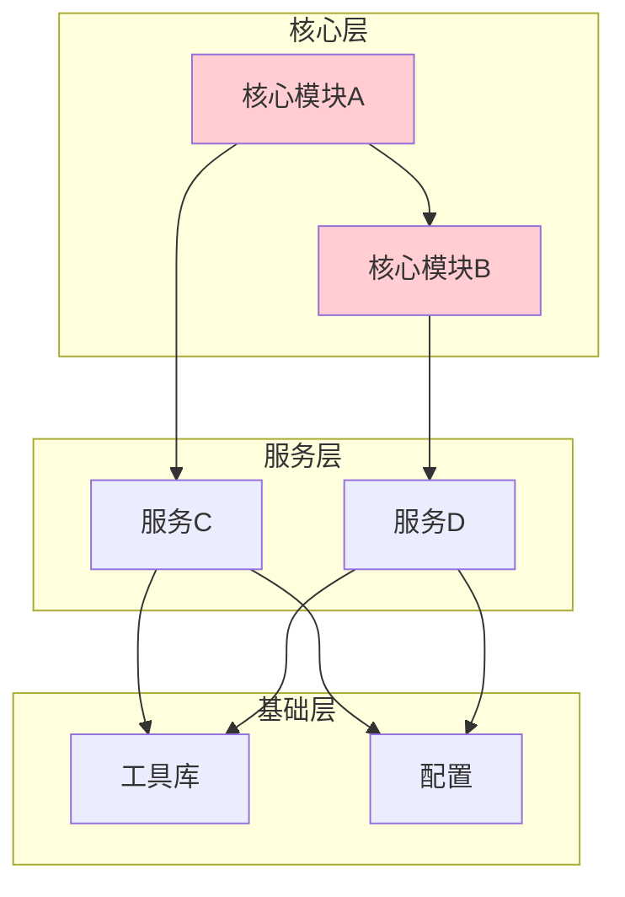
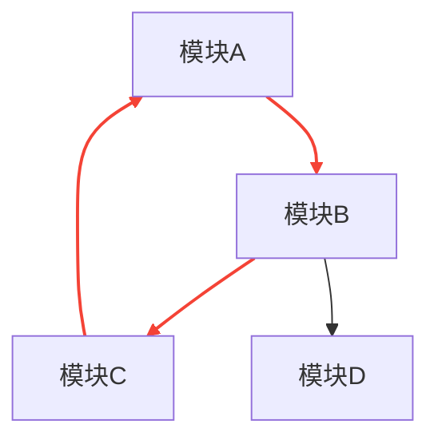

# 依赖图

## 目标
分析谁依赖谁，找出核心枢纽模块和耦合问题。

## 分析要求

1. 画出核心模块的依赖图
2. 找出高内聚、低耦合的部分
3. 找出强耦合、循环依赖、上帝模块
4. 说明依赖是通过 import、接口、事件、注册表还是反射建立的
5. 指出系统中最关键的 3 个枢纽模块

## 输出格式

```markdown
## 依赖关系

### 直接依赖
| 模块 | 依赖项 | 依赖方式 |
|------|--------|----------|
| | | |

### 反向依赖（被依赖）
| 模块 | 被谁依赖 | 依赖方式 |
|------|----------|----------|
| | | |

## 枢纽模块
| 排名 | 模块 | 被依赖次数 | 重要性说明 |
|------|------|------------|------------|
| 1 | | | |
| 2 | | | |
| 3 | | | |

## 耦合分析

### 高内聚低耦合
[列出设计良好的模块]

### 强耦合
[列出耦合过紧的模块]

### 循环依赖
| 模块A | 模块B | 循环路径 |
|-------|-------|----------|
| | | |

### 上帝模块
[列出承担过多职责的模块]

## 依赖方式统计
| 方式 | 数量 | 示例 |
|------|------|------|
| import | | |
| 接口 | | |
| 事件 | | |
| 注册表 | | |
| 反射 | | |
```

## Mermaid 图表示例





## 适用场景
- 分析文件、模块、文件夹、整个项目
- 理解模块关系
- 重构前分析
