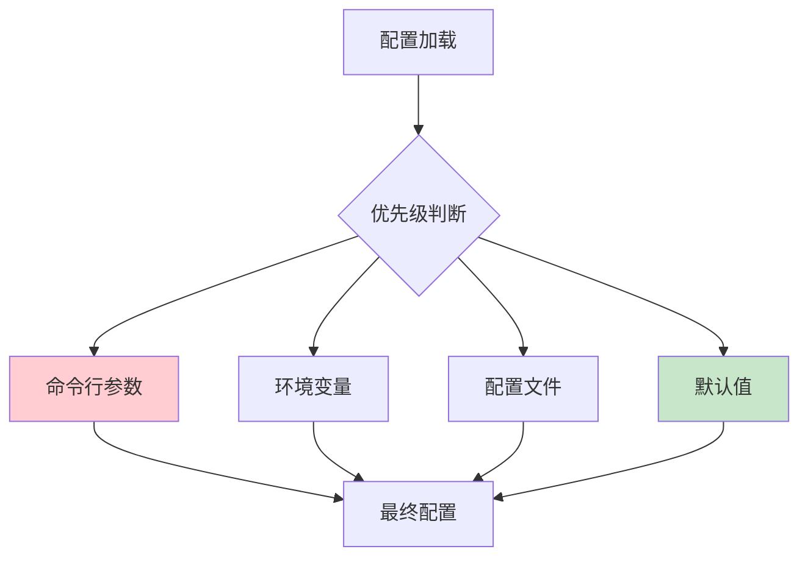

# 配置分析

## 目标
分析哪些开关控制系统行为，理解配置体系。

## 分析要求

1. 找出所有配置入口：环境变量、配置文件、命令行参数、远程配置
2. 说明每个配置控制什么行为
3. 标出默认值、优先级、覆盖关系
4. 区分开发/测试/生产配置
5. 找出最影响系统行为的 5 个配置项

## 输出格式

```markdown
## 配置入口

### 环境变量
| 变量名 | 默认值 | 作用 | 必需 |
|--------|--------|------|------|
| | | | |

### 配置文件
| 文件路径 | 格式 | 用途 | 加载时机 |
|----------|------|------|----------|
| | | | |

### 命令行参数
| 参数名 | 默认值 | 作用 | 示例 |
|--------|--------|------|------|
| | | | |

### 远程配置
| 配置源 | 获取方式 | 缓存策略 | 失败处理 |
|--------|----------|----------|----------|
| | | | |

## 配置优先级
[从高到低列出配置覆盖顺序]

## 关键配置项 TOP 5
| 排名 | 配置项 | 影响 | 推荐值 |
|------|--------|------|--------|
| 1 | | | |
| 2 | | | |
| 3 | | | |
| 4 | | | |
| 5 | | | |

## 环境差异
| 配置项 | 开发环境 | 测试环境 | 生产环境 |
|--------|----------|----------|----------|
| | | | |
```

## Mermaid 图表示例



## 适用场景
- 分析文件、模块、整个项目
- 理解系统配置体系
- 排查配置问题
