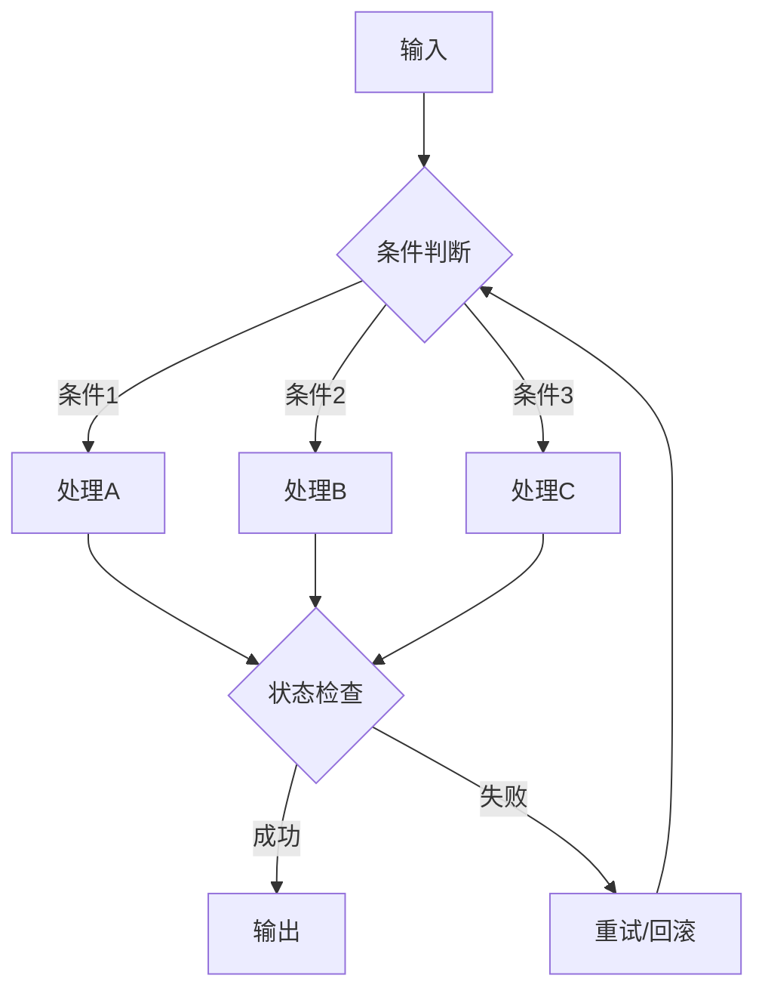
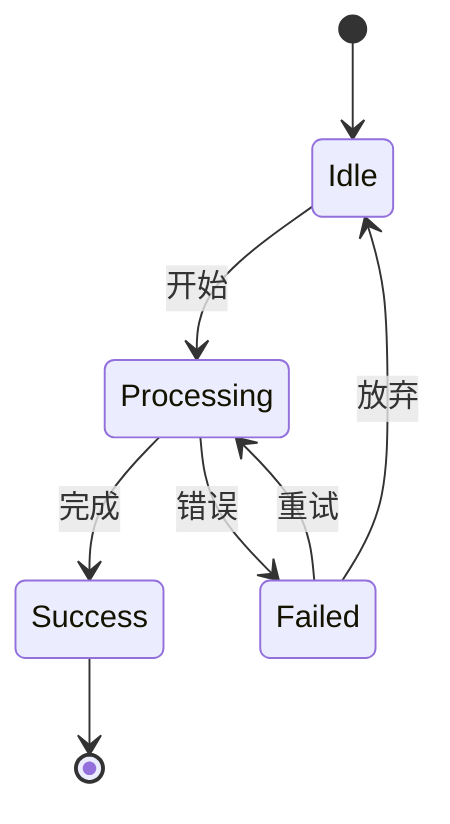

# 核心算法/核心机制

## 目标
深入分析最复杂、最核心的机制，理解系统的"心脏"。

## 分析要求

1. 识别最值得深入的 3~5 个文件/类/函数
2. 解释它们的算法、状态机或调度逻辑
3. 说明它们为什么复杂，复杂性来自哪里
4. 说明这些机制对整体架构的作用
5. 给出简化版伪代码或流程图

## 输出格式

```markdown
## 核心机制列表

### [机制1]
- 位置：
- 职责：
- 复杂性评分（1-5）：

#### 算法/逻辑说明
[详细描述]

#### 伪代码
```
[简化版伪代码]
```

#### 架构作用
[说明对整体架构的影响]

### [机制2]
...

## 复杂性来源分析
| 来源 | 涉及机制 | 说明 |
|------|----------|------|
| 业务复杂度 | | |
| 技术复杂度 | | |
| 集成复杂度 | | |
```

## Mermaid 图表示例





## 适用场景
- 分析函数、文件、模块
- 深入理解核心逻辑
- 复杂度评估
