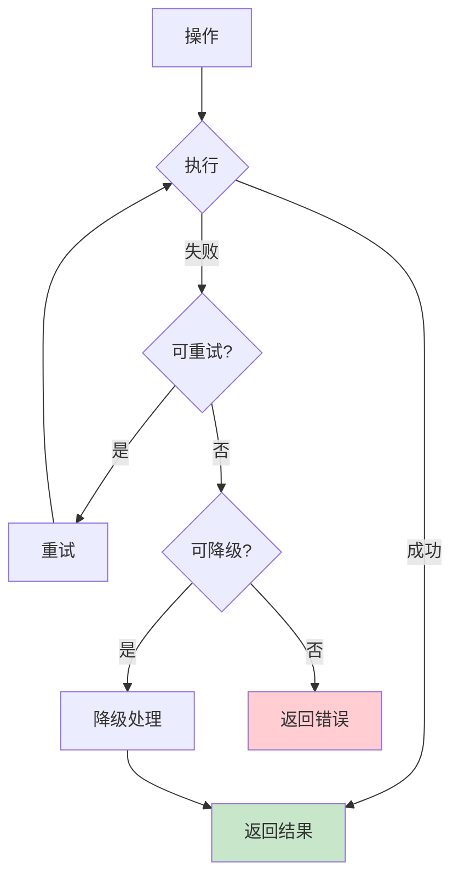

# 错误处理

## 目标
分析系统怎么失败、怎么恢复，理解系统的健壮性。

## 分析要求

1. 找出异常传播路径
2. 说明哪些错误会被吞掉，哪些会向上抛
3. 识别重试、降级、熔断、回滚、补偿逻辑
4. 说明日志与错误码设计
5. 找出最脆弱的失败点

## 输出格式

```markdown
## 错误模型

### 异常类型
| 异常类型 | 触发条件 | 处理方式 | 传播路径 |
|----------|----------|----------|----------|
| | | | |

### 错误码设计
| 错误码 | 含义 | 处理建议 |
|--------|------|----------|
| | | |

## 恢复机制

### 重试机制
| 场景 | 重试次数 | 重试间隔 | 放弃条件 |
|------|----------|----------|----------|
| | | | |

### 降级策略
| 场景 | 降级方案 | 触发条件 |
|------|----------|----------|
| | | |

### 熔断机制
| 服务 | 熔断条件 | 恢复条件 |
|------|----------|----------|
| | | |

### 回滚逻辑
| 操作 | 回滚条件 | 回滚步骤 |
|------|----------|----------|
| | | |

## 日志设计
| 日志级别 | 使用场景 | 示例 |
|----------|----------|------|
| ERROR | | |
| WARN | | |
| INFO | | |
| DEBUG | | |

## 脆弱点分析
| 排名 | 位置 | 风险描述 | 建议改进 |
|------|------|----------|----------|
| 1 | | | |
| 2 | | | |
| 3 | | | |
```

## Mermaid 图表示例



## 适用场景
- 分析函数、文件、模块、整个项目
- 评估系统健壮性
- 排查错误处理问题
