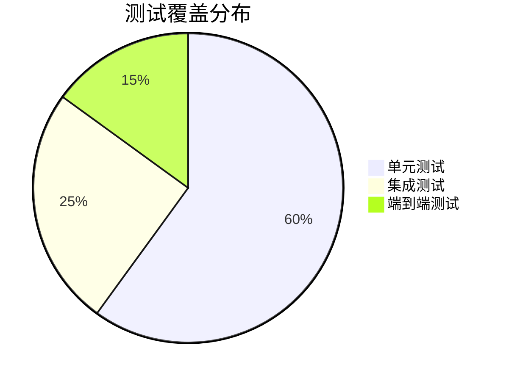
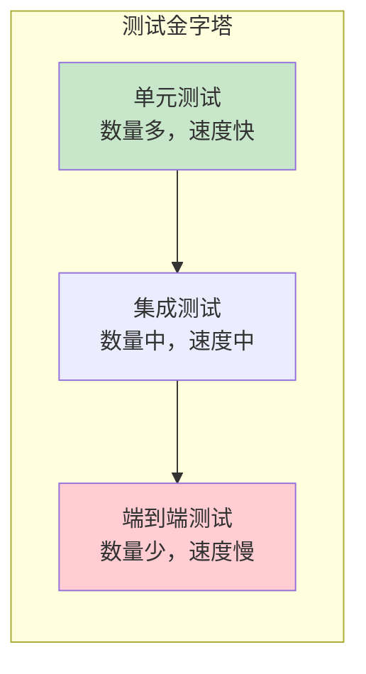

# 测试分析

## 目标
分析有没有真正验证关键逻辑，评估测试覆盖度。

## 分析要求

1. 找出单元测试、集成测试、端到端测试、回归测试
2. 对照核心模块判断测试覆盖是否充分
3. 找出 mock、fixture、test helper 的设计
4. 识别最缺测试的关键路径
5. 说明测试是否真的验证了架构意图

## 输出格式

```markdown
## 测试类型

### 单元测试
| 测试文件 | 覆盖模块 | 测试数量 | 覆盖率 |
|----------|----------|----------|--------|
| | | | |

### 集成测试
| 测试文件 | 测试场景 | 依赖项 |
|----------|----------|--------|
| | | |

### 端到端测试
| 测试文件 | 测试场景 | 前置条件 |
|----------|----------|----------|
| | | |

## 测试辅助设计

### Mock 设计
| Mock 对象 | Mock 方式 | 使用场景 |
|-----------|-----------|----------|
| | | |

### Fixture 设计
| Fixture | 用途 | 数据来源 |
|---------|------|----------|
| | | |

### Test Helper
| Helper | 功能 | 使用场景 |
|--------|------|----------|
| | | |

## 覆盖度分析

### 核心模块覆盖
| 模块 | 重要程度 | 测试覆盖 | 缺口评估 |
|------|----------|----------|----------|
| | | | |

### 高风险未测点
| 排名 | 位置 | 风险描述 | 建议测试 |
|------|------|----------|----------|
| 1 | | | |
| 2 | | | |
| 3 | | | |

## 测试质量评估
[评价测试是否真正验证了架构意图]
```

## Mermaid 图表示例





## 适用场景
- 分析文件、模块、整个项目
- 评估测试质量
- 测试改进规划
