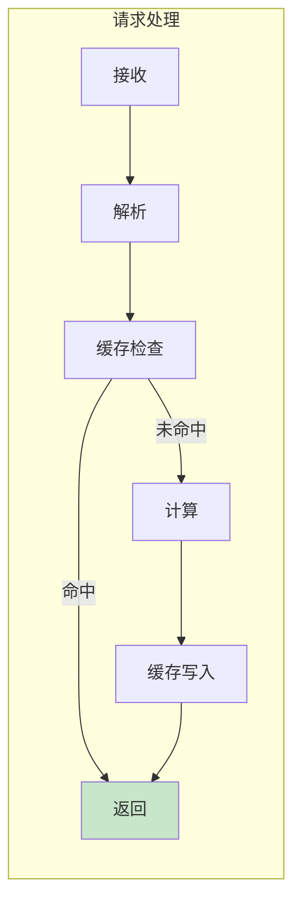

# 性能与并发

## 目标
分析哪里会慢、哪里会卡，理解系统的性能特征。

## 分析要求

1. 找出 IO 密集、CPU 密集、网络密集的路径
2. 说明是否有并发、异步、线程、进程、队列、批处理
3. 找出可能的瓶颈：重复计算、过度 IO、锁竞争、串行瓶颈
4. 说明是否有缓存、懒加载、预取、批量化策略
5. 给出最值得优化的 3 个点

## 输出格式

```markdown
## 性能特征

### IO 密集路径
| 路径 | IO 类型 | 频率 | 耗时估算 |
|------|----------|------|----------|
| | | | |

### CPU 密集路径
| 路径 | 计算类型 | 触发条件 | 耗时估算 |
|------|----------|----------|----------|
| | | | |

### 网络密集路径
| 路径 | 请求类型 | 并发数 | 超时设置 |
|------|----------|----------|----------|
| | | | |

## 并发模型

### 并发方式
| 类型 | 使用场景 | 实现方式 |
|------|----------|----------|
| 线程 | | |
| 进程 | | |
| 异步 | | |
| 队列 | | |

### 同步机制
| 机制 | 保护对象 | 粒度 | 性能影响 |
|------|----------|------|----------|
| | | | |

## 性能优化

### 缓存策略
| 缓存位置 | 缓存内容 | 过期策略 | 命中率估算 |
|----------|----------|----------|------------|
| | | | |

### 其他优化
| 策略 | 应用位置 | 效果 |
|------|----------|------|
| 懒加载 | | |
| 预取 | | |
| 批量化 | | |

## 瓶颈分析

### TOP 3 优化点
| 排名 | 位置 | 问题 | 优化建议 | 预期收益 |
|------|------|------|----------|----------|
| 1 | | | | |
| 2 | | | | |
| 3 | | | | |
```

## Mermaid 图表示例

```mermaid
gantt
    title 请求处理时间分布
    dateFormat X
    section 单次请求
    网络IO :0, 50
    解析 :50, 70
    计算 :70, 150
    序列化 :150, 170
    网络响应 :170, 220
```





## 适用场景
- 分析函数、文件、模块、整个项目
- 性能问题排查
- 性能优化规划
