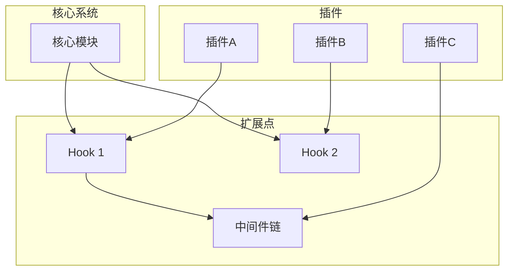

# 扩展点/插件机制

## 目标
分析系统能不能"长大"，理解扩展机制。

## 分析要求

1. 找出插件、hook、callback、registry、middleware、adapter、strategy 等扩展点
2. 说明新增功能应该接入哪里
3. 分析扩展机制是否稳定、是否易测试
4. 指出哪些地方是硬编码，限制了扩展
5. 说明系统更像"可插拔平台"还是"固定流程程序"

## 输出格式

```markdown
## 扩展点清单

### 插件系统
| 插件点 | 接口定义 | 加载方式 | 示例插件 |
|--------|----------|----------|----------|
| | | | |

### Hook 机制
| Hook 点 | 触发时机 | 参数 | 返回值影响 |
|---------|----------|------|------------|
| | | | |

### 回调机制
| 回调点 | 注册方式 | 触发条件 |
|--------|----------|----------|
| | | |

### 中间件
| 中间件位置 | 职责 | 执行顺序 |
|------------|------|----------|
| | | |

### 注册表
| 注册表 | 管理对象 | 注册方式 |
|--------|----------|----------|
| | | |

### 适配器
| 适配器 | 抽象接口 | 具体实现 |
|--------|----------|----------|
| | | |

### 策略模式
| 策略点 | 接口 | 实现类 |
|--------|------|--------|
| | | |

## 扩展指南

### 新增功能接入方式
[说明如何扩展系统功能]

### 扩展点稳定性评估
| 扩展点 | API 稳定性 | 文档完善度 | 测试覆盖 |
|--------|------------|------------|----------|
| | | | |

## 扩展限制

### 硬编码问题
| 位置 | 限制描述 | 改进建议 |
|------|----------|----------|
| | | |

## 平台化程度评估
[评估系统是"可插拔平台"还是"固定流程程序"]
```

## Mermaid 图表示例



## 适用场景
- 分析文件、模块、整个项目
- 理解扩展机制
- 扩展开发规划
