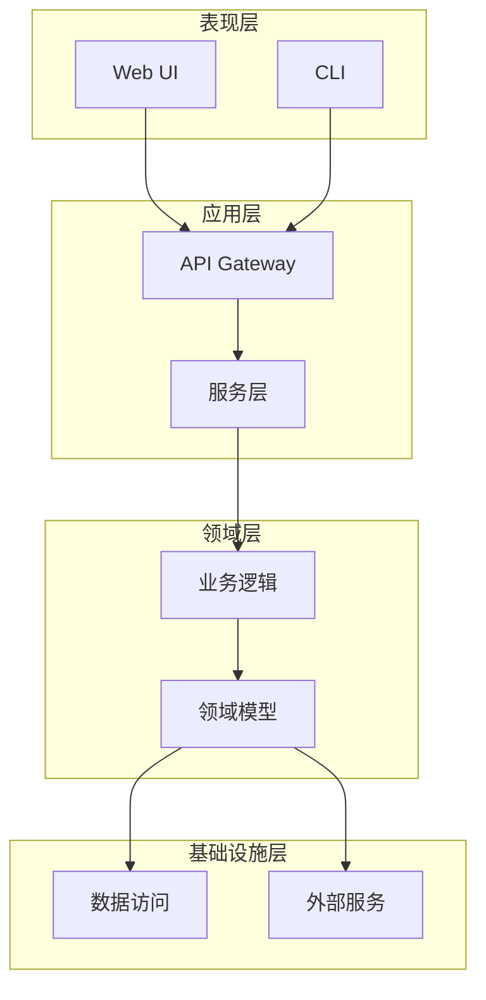
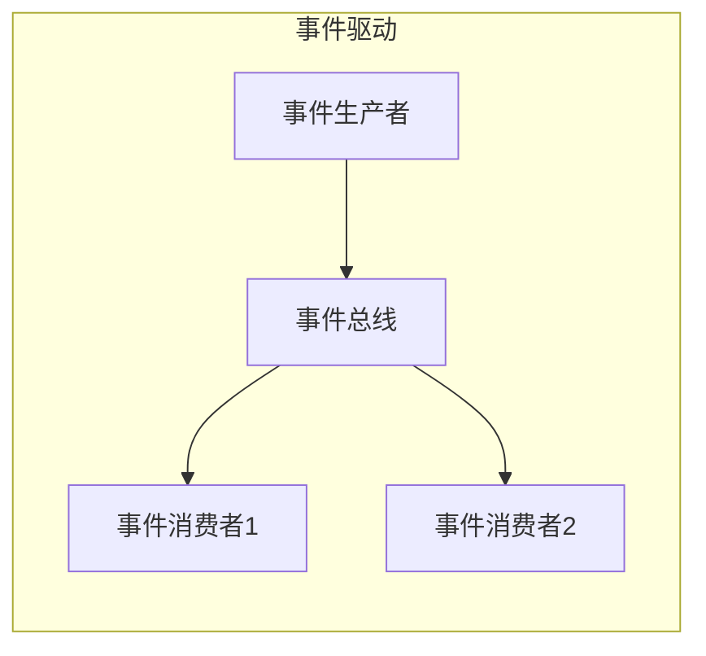

# 抽象架构

## 目标
总结这个仓库的架构模式，理解系统的"骨架"。

## 分析要求

1. 判断它更像：分层架构 / 事件驱动 / pipeline / graph / 状态机 / 插件式 / Agent loop / 客户端-服务端 / 微服务 / 单体
2. 解释你判断的证据
3. 说明控制流和数据流的主导方式
4. 说明系统的核心设计取舍
5. 给出一个架构图的文字版

## 输出格式

```markdown
## 架构模式

### 主要模式
[架构模式名称]

### 模式证据
[为什么判断是这个模式]

### 辅助模式
[可能混合的其他模式]

## 控制流与数据流

### 控制流主导方式
[说明请求/命令如何流转]

### 数据流主导方式
[说明数据如何流动]

## 设计取舍

### 核心取舍
| 取舍点 | 选择 | 放弃 | 原因 |
|--------|------|------|------|
| | | | |

### 架构优势
[列出架构的优点]

### 架构劣势
[列出架构的缺点]

## 架构图

### 概览图
```mermaid
[架构概览 Mermaid 图]
```

### 分层/模块图
```mermaid
[分层或模块结构图]
```

## 架构演进建议
[如果有明显问题，给出改进建议]
```

## Mermaid 图表示例





## 适用场景
- 分析模块、文件夹、整个项目
- 理解系统架构
- 架构评估与改进
