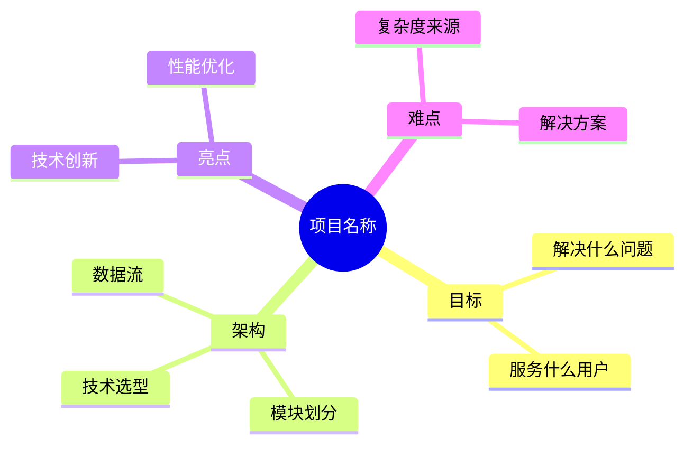

# 面试讲解版

## 目标
把仓库总结成"面试讲解版"，用简洁清晰的语言描述项目。

## 分析要求

1. 用 1 分钟讲清项目目标
2. 用 3 分钟讲清整体架构
3. 用 3 分钟讲清核心调用链
4. 用 2 分钟讲清亮点与难点
5. 用 1 分钟讲清不足与改进方向

## 输出格式

```markdown
## 项目讲解

### 1 分钟版 - 项目目标
[一句话说清楚这个项目是做什么的，解决什么问题]

### 3 分钟版 - 整体架构

#### 技术选型
[为什么选择这些技术]

#### 架构设计
[核心架构是什么样的]

#### 模块划分
[系统由哪些模块组成]

### 3 分钟版 - 核心调用链
[描述最核心的一条业务流程]

```
用户请求 → [处理步骤1] → [处理步骤2] → ... → 返回结果
```

### 2 分钟版 - 亮点与难点

#### 技术亮点
1. [亮点1]
2. [亮点2]
3. [亮点3]

#### 技术难点
1. [难点1] - 解决方案：[如何解决的]
2. [难点2] - 解决方案：[如何解决的]

### 1 分钟版 - 不足与改进
[诚实地说出不足之处和改进方向]

## 面试要点备忘
[面试官可能会问的问题和回答要点]
```

## Mermaid 图表示例



## 适用场景
- 分析整个项目
- 项目汇报
- 面试准备
- 项目交接
